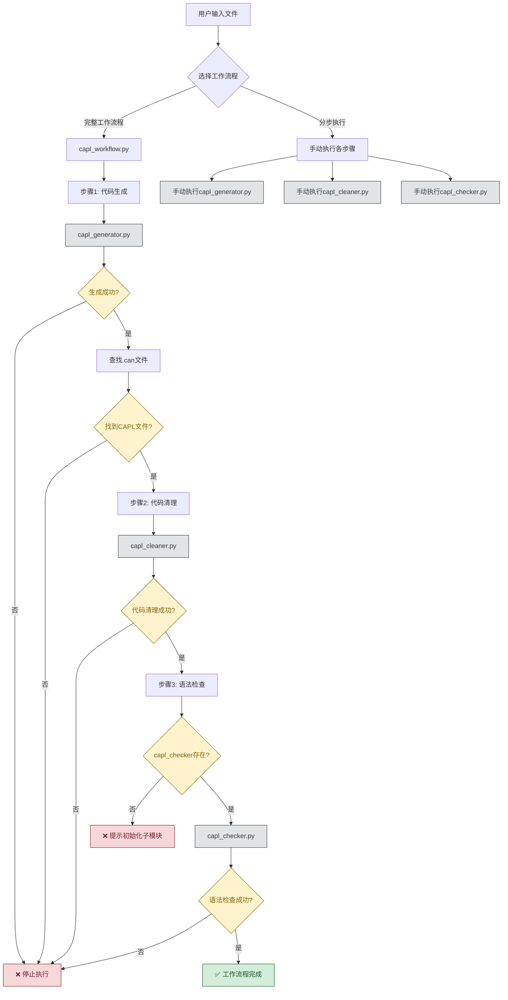
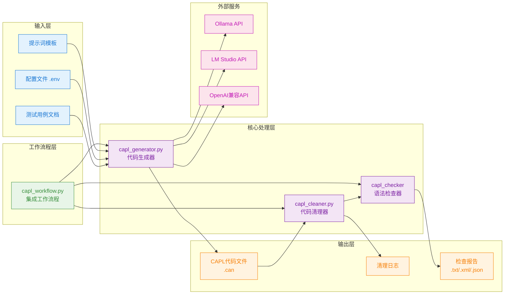
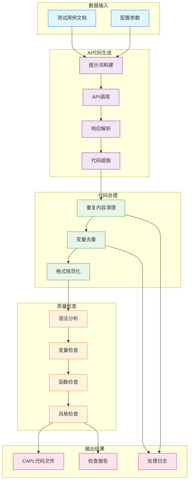
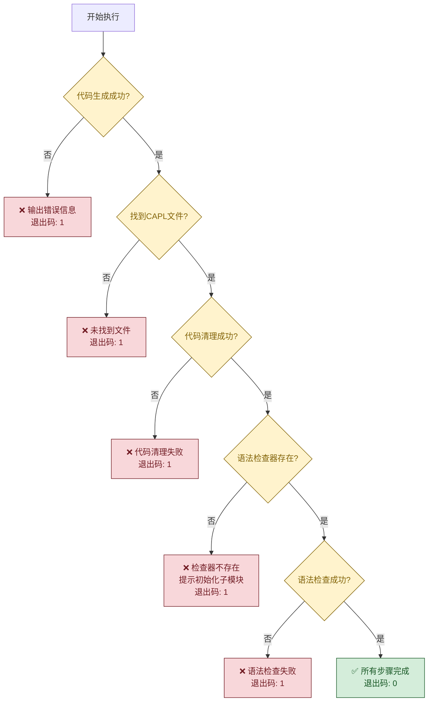
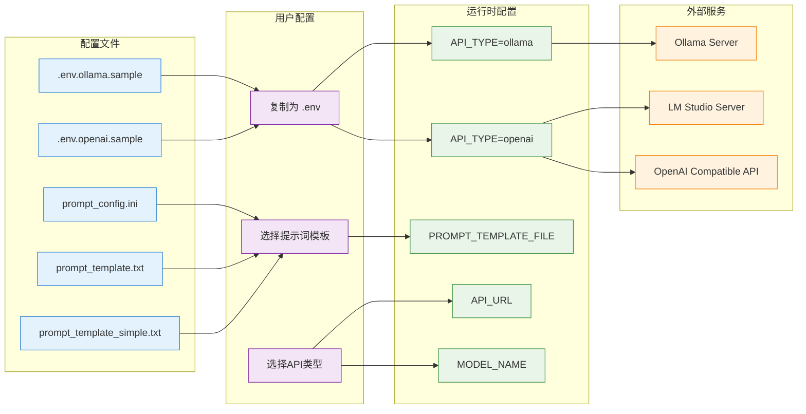

# CAPL 测试用例生成器 - 处理流程图

## 项目架构流程图

```mermaid
graph TD
    A[用户输入文件] --> B{选择工作流程}
    
    B -->|完整工作流程| C[capl_workflow.py]
    B -->|分步执行| D[手动执行各步骤]
    
    C --> E[步骤1: 代码生成]
    E --> F[capl_generator.py]
    F --> G{生成成功?}
    G -->|否| H[❌ 停止执行]
    G -->|是| I[查找.can文件]
    
    I --> J{找到CAPL文件?}
    J -->|否| H
    J -->|是| K[步骤2: 代码清理]
    
    K --> N[capl_cleaner.py]
    N --> O{代码清理成功?}
    O -->|否| H
    O -->|是| P[步骤3: 语法检查]
    
    P --> Q{capl_checker存在?}
    Q -->|否| R[❌ 提示初始化子模块]
    Q -->|是| S[capl_checker.py]
    S --> T{语法检查成功?}
    T -->|否| H
    T -->|是| U[✅ 工作流程完成]
    
    %% 分步执行路径
    D --> V[手动执行capl_generator.py]
    D --> X[手动执行capl_cleaner.py]
    D --> Y[手动执行capl_checker.py]
    
    %% 样式定义
    classDef success fill:#d4edda,stroke:#155724,color:#155724
    classDef error fill:#f8d7da,stroke:#721c24,color:#721c24
    classDef process fill:#e2e3e5,stroke:#383d41,color:#383d41
    classDef decision fill:#fff3cd,stroke:#856404,color:#856404
    
    class U success
    class H,R error
    class F,N,S,V,X,Y process
    class G,J,O,Q,T decision
```

## 详细组件架构图

```mermaid
graph LR
    subgraph "输入层"
        A1[测试用例文档]
        A2[配置文件 .env]
        A3[提示词模板]
    end
    
    subgraph "核心处理层"
        B1[capl_generator.py<br/>代码生成器]
        B2[capl_cleaner.py<br/>代码清理器]
        B3[capl_checker<br/>语法检查器]
    end
    
    subgraph "工作流程层"
        C1[capl_workflow.py<br/>集成工作流程]
    end
    
    subgraph "输出层"
        D1[CAPL代码文件<br/>.can]
        D2[检查报告<br/>.txt/.xml/.json]
        D3[清理日志]
    end
    
    subgraph "外部服务"
        E1[Ollama API]
        E2[LM Studio API]
        E3[OpenAI兼容API]
    end
    
    A1 --> B1
    A2 --> B1
    A3 --> B1
    B1 --> E1
    B1 --> E2
    B1 --> E3
    
    B1 --> D1
    D1 --> B2
    B2 --> B3
    B3 --> D2
    B2 --> D3
    
    C1 --> B1
    C1 --> B2
    C1 --> B3
    
    %% 样式定义
    classDef input fill:#e3f2fd,stroke:#1976d2,color:#1976d2
    classDef core fill:#f3e5f5,stroke:#7b1fa2,color:#7b1fa2
    classDef workflow fill:#e8f5e8,stroke:#388e3c,color:#388e3c
    classDef output fill:#fff3e0,stroke:#f57c00,color:#f57c00
    classDef external fill:#fce4ec,stroke:#c218b5,color:#c218b5
    
    class A1,A2,A3 input
    class B1,B2,B3 core
    class C1 workflow
    class D1,D2,D3 output
    class E1,E2,E3 external
```

## 数据流程图

```mermaid
flowchart TD
    subgraph "数据输入"
        A[测试用例文档]
        B[配置参数]
    end
    
    subgraph "AI代码生成"
        C[提示词构建]
        D[API调用]
        E[响应解析]
        F[代码提取]
    end
    
    subgraph "代码处理"
        H[重复内容清理]
        I[变量去重]
        J[格式规范化]
    end
    
    subgraph "质量检查"
        K[语法分析]
        L[变量检查]
        M[函数检查]
        N[风格检查]
    end
    
    subgraph "输出结果"
        O[CAPL代码文件]
        P[检查报告]
        Q[处理日志]
    end
    
    A --> C
    B --> C
    C --> D
    D --> E
    E --> F
    F --> H
    H --> I
    I --> J
    J --> K
    K --> L
    L --> M
    M --> N
    N --> O
    N --> P
    H --> Q
    I --> Q
    
    %% 样式定义
    classDef input fill:#e1f5fe,stroke:#0277bd
    classDef ai fill:#f3e5f5,stroke:#7b1fa2
    classDef process fill:#e8f5e8,stroke:#388e3c
    classDef check fill:#fff3e0,stroke:#f57c00
    classDef output fill:#fce4ec,stroke:#c218b5
    
    class A,B input
    class C,D,E,F ai
    class H,I,J process
    class K,L,M,N check
    class O,P,Q output
```

## 错误处理流程图

```mermaid
graph TD
    A[开始执行] --> B{代码生成成功?}
    B -->|否| C[❌ 输出错误信息<br/>退出码: 1]
    B -->|是| D{找到CAPL文件?}
    D -->|否| E[❌ 未找到文件<br/>退出码: 1]
    D -->|是| H{代码清理成功?}
    H -->|否| I[❌ 代码清理失败<br/>退出码: 1]
    H -->|是| J{语法检查器存在?}
    J -->|否| K[❌ 检查器不存在<br/>提示初始化子模块<br/>退出码: 1]
    J -->|是| L{语法检查成功?}
    L -->|否| M[❌ 语法检查失败<br/>退出码: 1]
    L -->|是| N[✅ 所有步骤完成<br/>退出码: 0]
    
    %% 样式定义
    classDef success fill:#d4edda,stroke:#155724,color:#155724
    classDef error fill:#f8d7da,stroke:#721c24,color:#721c24
    classDef decision fill:#fff3cd,stroke:#856404,color:#856404
    
    class N success
    class C,E,I,K,M error
    class B,D,H,J,L decision
```

## 配置管理流程图

```mermaid
graph LR
    subgraph "配置文件"
        A1[.env.ollama.sample]
        A2[.env.openai.sample]
        A3[prompt_config.ini]
        A4[prompt_template.txt]
        A5[prompt_template_simple.txt]
    end
    
    subgraph "用户配置"
        B1[复制为 .env]
        B2[选择API类型]
        B3[选择提示词模板]
    end
    
    subgraph "运行时配置"
        C1[API_TYPE=ollama]
        C2[API_TYPE=openai]
        C3[PROMPT_TEMPLATE_FILE]
        C4[API_URL]
        C5[MODEL_NAME]
    end
    
    subgraph "外部服务"
        D1[Ollama Server]
        D2[LM Studio Server]
        D3[OpenAI Compatible API]
    end
    
    A1 --> B1
    A2 --> B1
    A3 --> B3
    A4 --> B3
    A5 --> B3
    
    B1 --> C1
    B1 --> C2
    B2 --> C4
    B2 --> C5
    B3 --> C3
    
    C1 --> D1
    C2 --> D2
    C2 --> D3
    
    %% 样式定义
    classDef config fill:#e3f2fd,stroke:#1976d2
    classDef user fill:#f3e5f5,stroke:#7b1fa2
    classDef runtime fill:#e8f5e8,stroke:#388e3c
    classDef external fill:#fff3e0,stroke:#f57c00
    
    class A1,A2,A3,A4,A5 config
    class B1,B2,B3 user
    class C1,C2,C3,C4,C5 runtime
    class D1,D2,D3 external
```